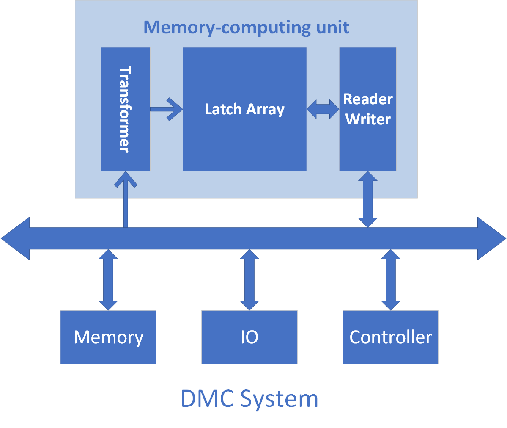

I'm a PhD student at network and cloud systems research group, Max Planck Institute for Informatics ([MPI-INF](https://www.mpi-inf.mpg.de/home)), working with Excellent [Prof. Yiting Xia](https://sites.google.com/view/yitingxia/home?authuser=0).

Before joining MPI, I got my B.S. in Comuputer Science at [Beijing University of Posts and Telecommunications](https://en.wikipedia.org/wiki/Beijing_University_of_Posts_and_Telecommunications). I was fortunate to work with [Prof. Jian Huang](http://jianh.web.engr.illinois.edu/) as a research intern at the [University of Illinois Urbana-Champaign](https://illinois.edu/) in the summer of 2020. I spent wonderful half a year as an exchange student in [Institut supérieur d’électronique de Paris (ISEP)](https://en.isep.fr/) in Paris during 2019, advised by [Prof. Raja Chiky](http://perso.isep.fr/rchiky/) and [Prof. Xun Zhang](http://zhangxun.free.fr/).

I love building systems. My research aims to design efficient networked systems, especially for data centers, through hardware-software co-design and cross-layer optimizations. My past research includes **optical data center networks**, **systems for machine learning**, and **hardware accelerators**. I have designed protocols for reconfigurable networks with data plane programmability and developed a specialized FPGA-based accelerator for SAT solving.

<!---
My research interests lie generally in computer architecture and system, particularly in the intersection of computation and storage. As the storage techniques develop and massive amounts of data are created every day, there emerges a bottleneck between storage and computation nodes, not only because of hardware limitations, but out-of-date computation models as well. My research aims to build efficient systems by utilizing and hybridizing computation and storage from processor-level to datacenter-level. I worked on **specialized processor** and **data-centric computing**.
-->

I play with
* Programmable Switches (P4 + Tofino/Tofino2)
* Pytorch
* FPGA
* To be continue...
  

News
======
* [OpenOptics](https://ymlei.github.io/) has been accepted as a SIGCOMM ’24 DEMO! See you in Sydney!
* [UCMP](https://ymlei.github.io/) has been accepted by SIGCOMM'24!
* I will be volunteering for SOSP'23. See you in Koblenz!
* [EchelonFlow](https://dl.acm.org/doi/abs/10.1145/3563766.3564096) is published at HotNets'2022!
* [HOHO](https://conferences.sigcomm.org/events/apnet2022/papers/Hop-On%20Hop-Off%20Routing.pdf) is published at APNET'2022!

Services
======
* Artifact Evaluation Committee for OSDI'24 and ATC'24

Education
======
* Oct 2021 - Present PhD Student at [MPI-INF](https://www.mpi-inf.mpg.de/home)
* Sep 2017 - Jun 2021 B.Sc in Computer Science at [Beijing University of Posts and Telecommunications](https://en.wikipedia.org/wiki/Beijing_University_of_Posts_and_Telecommunications), Beijing, China
* Sep 2019 - Feb 2020 Exchange Student at [Institut supérieur d’électronique de Paris (ISEP)](https://en.isep.fr/), Paris, France  

Past Resarch Projects
======

Digital Molecular Computer
------
Digital Molecular Computer (DMC) is an in-memory computing architecture, created to solve large scale combination problems. Inspired by molecular/DNA computer, DMC combines massive parallelism of molecular computing and high speed of digital computer. Specialized microarchitecture and ISA are designed to achieve the well-organized parallelism. 
We implemented the DMC prototype in FPGA and processed variable-limited boolean satisfiability problems.
  
{:height="60%" width="60%"}
 
For more information: [Abstract](../files/abstract2.pdf) [Video](https://www.youtube.com/watch?v=QWBxIEiYPYo)

In-Storage Computing
------
The idea of in-storage computing is moving the computation to storage device to reduce data movement. The performance benefits from IO reduction but degrades from computing weakness in SSD. We modeled that tradeoff with parameters of IO, processor, dispatch model and workload metrics. The model provides a threshold of workloads' IPB(Instruction per Byte) to determine whether a workload dispatch policy benefits from the in-storage computing system. It also provides a quantitative tool for analysis and guides us to develop dynamic workload dispatch systems in the future. 

Misc.
======
 In my spare time, I enjoy tennis, bouldering, biking, jogging, reading, cooking, driving, hiking... 
  

 

