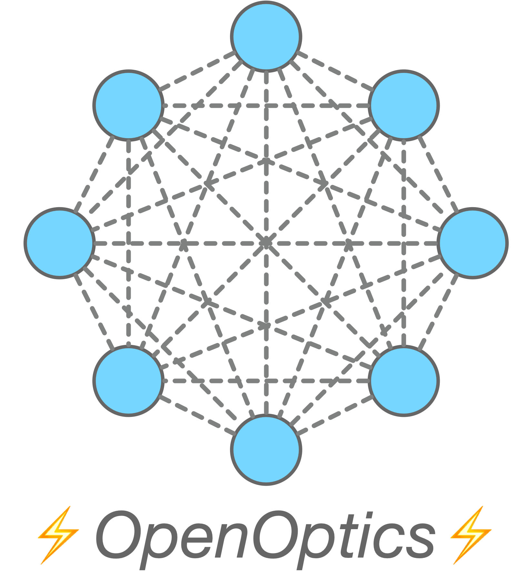

---
# Feel free to add content and custom Front Matter to this file.
# To modify the layout, see https://jekyllrb.com/docs/themes/#overriding-theme-defaults

layout: home
---

    
    

        
<a href="https://www.linkedin.com/in/yiming-lei-939658180/">LinkedIn</a>

        
<a href="https://scholar.google.com/citations?user=38hLSOgAAAAJ&hl=en">Google Scholar</a>

    

I’m a PhD student at the Max Planck Institute for Informatics ([MPI-INF](https://www.mpi-inf.mpg.de/home)), working on data center networks with [Yiting Xia](https://sites.google.com/view/yitingxia/home?authuser=0).
During my PhD, I interned at AWS AI, where I built resilient training systems for [JAX](https://docs.jax.dev/en/latest/index.html).

I love building systems. My experience spans programmable networks, fault-tolerant distributed ML training, high-precision time synchronization, and hardware acceleration with FPGAs.

News
======
* [OpenOptics](https://openoptics.mpi-inf.mpg.de/) has been accepted at **NSDI'26**!
* [SyncWise](https://ymlei.github.io/) has been accepted at **NSDI'26**!
* We will host a tutorial on [OpenOptics](https://openoptics.mpi-inf.mpg.de/) at [SIGCOMM'25](https://conferences.sigcomm.org/sigcomm/2025/). See you in Coimbra, Portugal!

Selected Publications
======================
* **[NSDI’26]** OpenOptics: An Open Research Framework for Optical Data Center Networks. 
**Yiming Lei**, Federico De Marchi, Raj Joshi, Jialong Li, Balakrishnan Chandrasekaran, Yiting Xia.

* **[NSDI’26]** SyncWise: Error-Aware Time Synchronization for Reconfigurable Data Center Networks. 
**Yiming Lei**, Jialong Li, Zhengqing Liu, Raj Joshi, Yiting Xia.

* **[ToN’25]** Unlocking diversity of fast-switched optical data center networks with unified routing. 
Jialong Li, Federico De Marchi, **Yiming Lei**, Raj Joshi, Balakrishnan Chandrasekaran, Yiting Xia.

* **[SIGCOMM’24]** Uniform-cost multi-path routing for reconfigurable data center networks. 
Jialong Li, Haotian Gong, Federico De Marchi, Aoyu Gong, **Yiming Lei**, Wei Bai, Yiting Xia.

* **[HotNets’22]** Efficient Flow Scheduling in Distributed Deep Learning Training with Echelon 
Formation.
Rui Pan*, **Yiming Lei***, Jialong Li, Zhiqiang Xie, Binhang Yuan, Yiting Xia. (*Equal Contributions).

Software
=========

  
  

    OpenOptics (<a href="https://openoptics.mpi-inf.mpg.de/">Website</a>, <a href="https://github.com/mpi-ncs/openoptics">GitHub</a>) - realizing customized optical data center networks with ~10 lines of code in Python.
  

Projects
=========

**SyncWise** - A time synchronization protocol for reconfigurable data center networks that outperforms SOTA (PTP, Sundial,Graham) even on static networks.

**ResilienX** - Checkpoint-free failure recovery for JAX, significantly reducing training wall time while preserving training correctness.

[EchelonFlow](https://dl.acm.org/doi/pdf/10.1145/3563766.3564096) - Parallelism-aware flow scheduling for collective communication in distributed ML training.

[Digital Molecular Computer](https://www.youtube.com/watch?v=QWBxIEiYPYo&ab_channel=AlexLei) - A specialized processor for boolean satisfiability problem (SAT) inspired by molecular computing. Prototyped with Verilog and FPGA.

Experience
======
* Oct 2021 – Present PhD Student, [Max Planck Institute for Informatics](https://www.mpi-inf.mpg.de/home)
* Sep 2024 – Mar 2025 Applied Scientist Intern, AWS
* Jul 2020 – Mar 2021 Research Assistant, [University of Illinois Urbana-Champaign](https://illinois.edu/)
* Sep 2019 – Feb 2020 Exchange Student, [Institut supérieur d’électronique de Paris (ISEP)](https://en.isep.fr/)
* Sep 2017 - Jun 2021 B.Sc in Computer Science, [Beijing University of Posts and Telecommunications](https://en.wikipedia.org/wiki/Beijing_University_of_Posts_and_Telecommunications)

Misc.
=======
Outside the office, you’ll often find me playing tennis, bouldering, hiking, experimenting in the kitchen, or hanging out with my cat.

